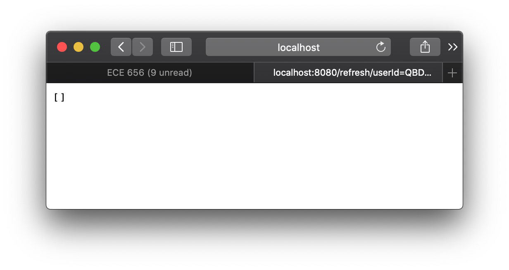
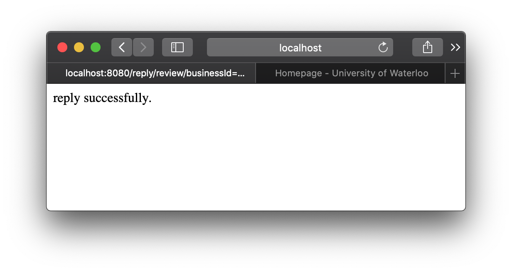
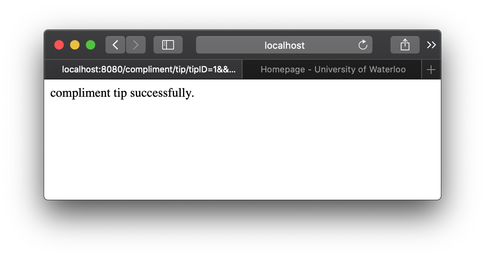
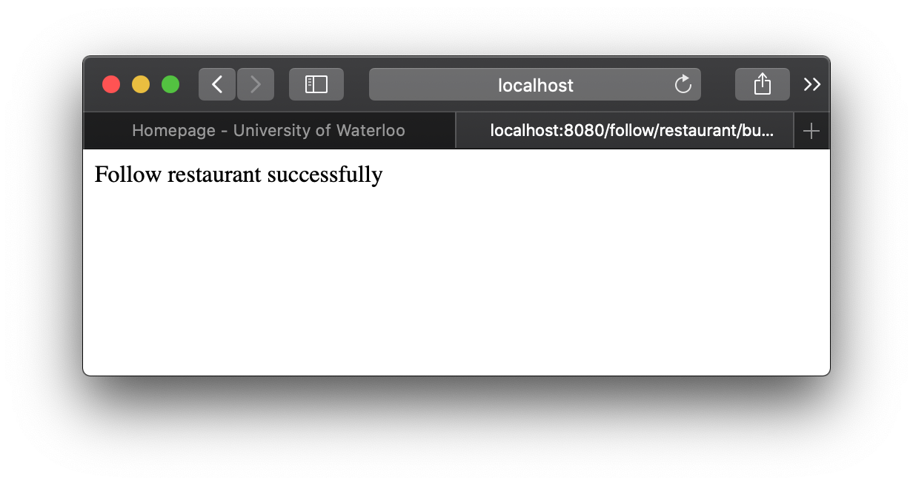
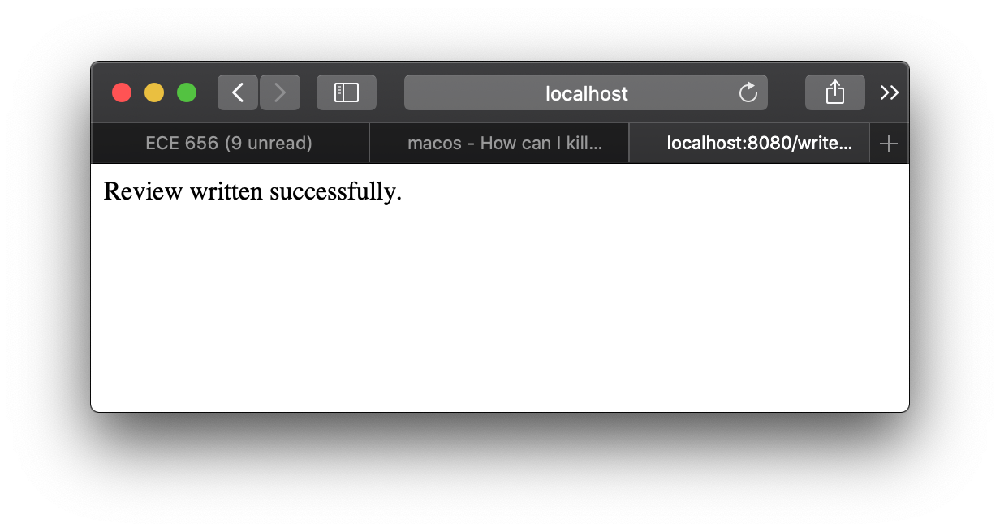
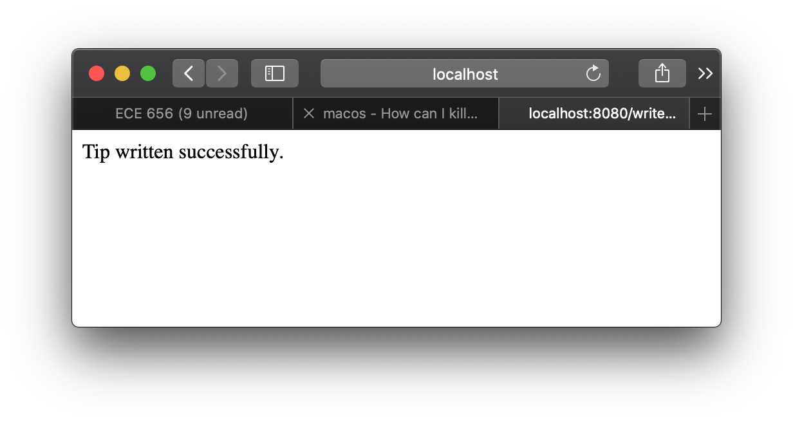

# **ECE656 Project Report: A Simple Social Network (with Yelp Dataset)**

Student Name: Libang Liang, Student ID: 20662701

Student Name: Zhiming Lin, Student ID:


#### 1. ER Model

#### 2. Create Tables

#### 3. Populating the data

Total size of the JSON data: 9.8GB

We first used Python Script to generate SQL batched insert statement to insert large JSON file.

**Implementation** 

Take populating review as an example:

```python
def populateReview(review_file_path):
    if os.path.exists("generateReview.sql"):
        os.remove("generateReview.sql")
    gff =  open("generateReview.sql", "a")
    gff.write("DELETE FROM review;\n")
    gff.write("BEGIN;\n")

    count = 0
    set_batch_size = 100
    batch_size = set_batch_size

    file_count = 1
    # test_size = 100000
    with open(review_file_path) as f:
        print("test")
        query = "\n INSERT INTO review (review_id,user_id, business_id,stars,reviewDate,reviewTime,reviewText,useful,funny,cool) VALUES "
        for line in f:
            if batch_size == set_batch_size:
                gff.write(query)
            count+=1
            print(" %d / 6685900"%(count), end='\r')
            data = json.loads(line)

            review_id = data["review_id"]
            user_id = data["user_id"]
            business_id = data["business_id"]
            stars = data["stars"]
            date_time = data["date"]
            reviewText = data["text"]
            useful = data["useful"]
            funny = data["funny"]
            cool = data["cool"]

            reviewDate,reviewTime = date_time.split()

            reviewText = reviewText.replace('"',"")
            reviewText = reviewText.replace(';',"")
            reviewText = reviewText.replace('\\', '/ ')

            value = "(\'"+str(review_id)+"\',"+"\'"+ str(user_id)+"\',"+"\'"+ str(business_id)+"\',"+"\'"+ str(stars)+"\',"+"\'"+ str(reviewDate)+"\',"+"\'"+str(reviewTime)+"\',"+"\""+ str(reviewText)+"\","+"\'"+ str(useful)+"\',"+"\'"+ str(funny)+"\',"+"\'"+ str(cool)+"\')"

            batch_size-=1;
            if batch_size == 0:
                value += ";"
                batch_size = set_batch_size
            else:
                value += ","

            gff.write(value)


    gff.write(";")
    gff.write("\nCOMMIT;")
    gff.close()
```

We first create an empty sql file. Then we read the JSON file in batches. In the review text object, we replaced the ambiguous characters to the mysql statements. we then write the SQL statements into the sql files. Finally We source this .sql file in the mysql session.


#### 4. Client(README)

We created set of APIs using Java with Spring Boot Framwork. User can do the following functions:

1. Register
   User should be able to register a new user account by providing a user name, a unique user id is created and returned to the user.

2. Login
   User should be able to login ther account by providing their user id.

3. Refresh new reviews if they followed any business(restaurant) or friends
   User should be able to look at their unseen reviews based on the 1. business(restaurant) they followed, 2. freinds they have.

4. Make friend request

   User should be able to make friend request if they can provide friend's user id.
   
5. Accept/Reject friend request
   User should be able to accept or reject any pending friend request.

6. Vote(useful, funny, cool) review
   User should be able to vote reviews if they can provide the review id and the type of vote.

7. Follow User
   User should be able to follow user.

8. Choose Elite User
   User could be chosen to be elite user for specific year.

9. Reply Review
   User should be able to reply a review if they can provide the original review id.

   

10. Upvote a Tip
    User should be able to upvote a tip if they can provide tip id.

11. Create a Group
    User should be able to create a group if they can provide list of user id(s).

12. Join an existing group
    User should be able to join an existing group if they can provide a group id.

13. Follow a Business(Restaurant)
    User should be able to follow a business(restaurant) if they can provide the business id.

14. Write a Review on a Business(Restaurant)
    User should be able to post(write an review) on topic(business/restaurant).

15. Write a Tip on a Business(Restaurant)
    User should be able to write a tip on topic(business/restaurant).


**Testing**

Testing can be done by starting the server, and copy and paste the following urls to the browser.

By checking the return objects values, once could determine the result of the execution.


**Register**

```
curl -X POST "localhost:8080/register/test1";
```

Register successfully. Your userID is f7@N@@3QViWEpZL1Jtrla6


**Login**

```
curl -X GET "localhost:8080/login/___DPmKJsBF2X6ZKgAeGqg";
```

Login Successfully. Your UserID is: ___DPmKJsBF2X6ZKgAeGqg


**Refresh new reviews**

```
curl -X GET "localhost:8080/refresh/userId=QBDLNWKgldFPAfj8Z8F9Xg";
```

Before:

```mysql
mysql> select * from user_last_refresh;
Empty set (0.00 sec)
```

After:

```mysql
mysql> select * from user_last_refresh;
+------------------------+--------------+--------------+
| user_id                | refresh_time | refresh_date |
+------------------------+--------------+--------------+
| QBDLNWKgldFPAfj8Z8F9Xg | 14:15:23     | 2020-03-29   |
+------------------------+--------------+--------------+
1 row in set (0.00 sec)
```

Result:


Refresh again the returned result will be empty list(Since all read):



**Make friend request**

```
curl -X GET "localhost:8080/addFriendRequest/__-Kt26YrtJxGdWs8FqKCg";
```

Friend request sent. 

```mysql
mysql> select * from friendrequest;
+------------------------+------------------------+
| user_id                | friend_id              |
+------------------------+------------------------+
| ___DPmKJsBF2X6ZKgAeGqg | __-Kt26YrtJxGdWs8FqKCg |
+------------------------+------------------------+
1 row in set (0.00 sec)

```


**Reject friend request**

```
curl -X GET "localhost:8080/rejectFriendRequest/___DPmKJsBF2X6ZKgAeGqg";
```

Friend request rejected

```mysql
mysql> select * from friendrequest;
Empty set (0.00 sec)
```


**Accept friend request**

```
curl -X GET "localhost:8080/acceptFriendRequest/___DPmKJsBF2X6ZKgAeGqg";
```

Accept friend request successfully.

```mysql
mysql> select * from friend where user_id = '__-Kt26YrtJxGdWs8FqKCg' and friend_id = '___DPmKJsBF2X6ZKgAeGqg';
+------------------------+------------------------+
| user_id                | friend_id              |
+------------------------+------------------------+
| __-Kt26YrtJxGdWs8FqKCg | ___DPmKJsBF2X6ZKgAeGqg |
+------------------------+------------------------+
1 row in set (0.00 sec)
```

```mysql
mysql> select * from friendrequest;
Empty set (0.00 sec)
```


**Vote(useful, funny, cool) review**

Before:

```mysql
mysql> select user_id, funny from user where user_id = "___DPmKJsBF2X6ZKgAeGqg";
```

```
+------------------------+-------+
| user_id                | funny |
+------------------------+-------+
| ___DPmKJsBF2X6ZKgAeGqg |     5 |
+------------------------+-------+
1 row in set (0.00 sec)
```

```mysql
mysql> select review_id, funny from review where review_id = "___-Bw8LtQgezPiN9xJWaQ";
+------------------------+-------+
| review_id              | funny |
+------------------------+-------+
| ___-Bw8LtQgezPiN9xJWaQ |     1 |
+------------------------+-------+
1 row in set (0.00 sec)
```


```
// type => 0: useful, 1: funny, 2: cool
curl -X GET "localhost:8080/vote/review_id=___-Bw8LtQgezPiN9xJWaQ&&type=1";
```

vote successfully. 

```mysql
mysql> select user_id, funny from user where user_id = "___DPmKJsBF2X6ZKgAeGqg";
+------------------------+-------+
| user_id                | funny |
+------------------------+-------+
| ___DPmKJsBF2X6ZKgAeGqg |     6 |
+------------------------+-------+
1 row in set (0.00 sec)
```

```mysql
mysql> select review_id, funny from review where review_id = "___-Bw8LtQgezPiN9xJWaQ";
+------------------------+-------+
| review_id              | funny |
+------------------------+-------+
| ___-Bw8LtQgezPiN9xJWaQ |     2 |
+------------------------+-------+
1 row in set (0.00 sec)
```


**Follow User**

Before

```mysql
mysql> select fans from user where user_id = "__-Kt26YrtJxGdWs8FqKCg";
+------+
| fans |
+------+
|    3 |
+------+
1 row in set (0.00 sec)
```

```
curl -i -X GET "localhost:8080/follow/user/__-Kt26YrtJxGdWs8FqKCg";
```

follow successfully. 

After:

```mysql
mysql> select fans from user where user_id = "__-Kt26YrtJxGdWs8FqKCg";
+------+
| fans |
+------+
|    4 |
+------+
1 row in set (0.00 sec)
```


**Choose Elite User**

Before:

```mysql
mysql> select * from eliteYear where user_id = "__-Kt26YrtJxGdWs8FqKCg";
Empty set (0.00 sec)
```

```
curl -i -X GET "localhost:8080/eliteuser/__-Kt26YrtJxGdWs8FqKCg";
```

Elect user as elite user this year successfully. 

After:

```mysql
mysql> select * from eliteYear where user_id = "__-Kt26YrtJxGdWs8FqKCg";
+------------------------+-----------+
| user_id                | eliteYear |
+------------------------+-----------+
| __-Kt26YrtJxGdWs8FqKCg |      2020 |
+------------------------+-----------+
1 row in set (0.00 sec)
```


**Reply Review**

```
//Login First
http://localhost:8080/login/QBDLNWKgldFPAfj8Z8F9Xg
//Reply to specific review given review_id
http://localhost:8080/reply/review/businessId=5z1WIr7E9P2CSzyN5seeSA&&stars=5&&text=awesome&&responseTo=Y3pR0ZXAtxoROZ2NBE_CGQ

```



New review is generated:

```mysql
mysql> select review_id,reviewText from review where review_id = "3iL+xGMHxze^Ju+8D64gUJ";
+------------------------+------------+
| review_id              | reviewText |
+------------------------+------------+
| 3iL+xGMHxze^Ju+8D64gUJ | awesome    |
+------------------------+------------+
1 row in set (0.00 sec)

```

Relationship between reviews are also stored:

```mysql
mysql> select * from reviewRelation;
+------------------------+------------------------+
| review_id              | response_to_review_id  |
+------------------------+------------------------+
| 3iL+xGMHxze^Ju+8D64gUJ | Y3pR0ZXAtxoROZ2NBE_CGQ |
| Zz-HU-5DUJXfBv6zZA-9!K | Y3pR0ZXAtxoROZ2NBE_CGQ |
+------------------------+------------------------+
2 rows in set (0.00 sec)
```


**Upvote a Tip**

```
//hot:0, more:1, profile:2, cute:3, list:4, note:5, plain:6, cool:7, funny:8, writer:9, 
//photos:10

http://localhost:8080/compliment/tip/tipID=1&&compliment=3
```

Before:

```mysql
mysql> select user_id,compliment_cute from user where user_id =  'UPw5DWs_b-e2JRBS-t37Ag';
+------------------------+-----------------+
| user_id                | compliment_cute |
+------------------------+-----------------+
| UPw5DWs_b-e2JRBS-t37Ag |               0 |
+------------------------+-----------------+
1 row in set (0.00 sec)

mysql> select tip_id,compliment_count from tip where tip_id =1;
+--------+------------------+
| tip_id | compliment_count |
+--------+------------------+
|      1 |                0 |
+--------+------------------+
1 row in set (0.00 sec)
```



After:

```mysql
mysql> select user_id,compliment_cute from user where user_id =  'UPw5DWs_b-e2JRBS-t37Ag';
+------------------------+-----------------+
| user_id                | compliment_cute |
+------------------------+-----------------+
| UPw5DWs_b-e2JRBS-t37Ag |               1 |
+------------------------+-----------------+
1 row in set (0.00 sec)

mysql> select tip_id,compliment_count from tip where tip_id =1;
+--------+------------------+
| tip_id | compliment_count |
+--------+------------------+
|      1 |                1 |
+--------+------------------+
1 row in set (0.00 sec)
```


**Create a Group**

```
curl -i -X POST -H "Content-type: application/json" -d '{"groupName": "abc", "friends": ["___DPmKJsBF2X6ZKgAeGqg", "___fEWlObjtPaZ-pK0eq9g"]}' localhost:8080/creategroup;
```

```
Content-Type: text/plain;charset=UTF-8
Content-Length: 28
Date: Sun, 29 Mar 2020 19:16:40 GMT

create group successfully. 
```

Result:

```mysql
mysql> select * from group_info;
+------------------------+------+
| group_id               | name |
+------------------------+------+
| dbeZLQH8^PKCpu0X4c+RXt | abc  |
+------------------------+------+
1 row in set (0.00 sec)
```

```mysql
mysql> select * from user_group;
+------------------------+------------------------+
| group_id               | user_id                |
+------------------------+------------------------+
| dbeZLQH8^PKCpu0X4c+RXt | ___DPmKJsBF2X6ZKgAeGqg |
| dbeZLQH8^PKCpu0X4c+RXt | ___fEWlObjtPaZ-pK0eq9g |
| dbeZLQH8^PKCpu0X4c+RXt | QBDLNWKgldFPAfj8Z8F9Xg |
+------------------------+------------------------+
3 rows in set (0.00 sec)
```


**Join an existing group**

```

```


**Follow a Business(Restaurant)**

```
http://localhost:8080/follow/restaurant/businessId='__1uG7MLxWGFIv2fCGPiQQ'
```

Before:

```mysql
mysql> select * from user_follow_business;
Empty set (0.00 sec)
```



After:

```mysql
mysql> select * from user_follow_business;
+------------------------+------------------------+
| user_id                | business_id            |
+------------------------+------------------------+
| QBDLNWKgldFPAfj8Z8F9Xg | __1uG7MLxWGFIv2fCGPiQQ |
+------------------------+------------------------+
1 row in set (0.00 sec)
```


**Write a Review on a Business(Restaurant)**

```
http://localhost:8080/write/review/businessId=__1uG7MLxWGFIv2fCGPiQQ&&stars=5&&text="very good food"
```



Before:

```mysql
mysql> select review_id from review where user_id = 'QBDLNWKgldFPAfj8Z8F9Xg';
+------------------------+
| review_id              |
+------------------------+
| 3iL+xGMHxze^Ju+8D64gUJ |
| cQ-mvJZ9zneSYn7m0b2FAA |
| Zz-HU-5DUJXfBv6zZA-9!K |
+------------------------+
3 rows in set (0.00 sec)
```

After:

```mysql
mysql> select review_id from review where user_id = 'QBDLNWKgldFPAfj8Z8F9Xg';
+------------------------+
| review_id              |
+------------------------+
| 3iL+xGMHxze^Ju+8D64gUJ |
| cQ-mvJZ9zneSYn7m0b2FAA |
| FkNuOEzRdcPSKU3p-o@9M+ |
| Zz-HU-5DUJXfBv6zZA-9!K |
+------------------------+
4 rows in set (0.00 sec)

mysql> select * from review where review_id = 'FkNuOEzRdcPSKU3p-o@9M+';
+------------------------+------------------------+------------------------+-------+------------+------------+----------------+--------+-------+------+
| review_id              | user_id                | business_id            | stars | reviewDate | reviewTime | reviewText     | useful | funny | cool |
+------------------------+------------------------+------------------------+-------+------------+------------+----------------+--------+-------+------+
| FkNuOEzRdcPSKU3p-o@9M+ | QBDLNWKgldFPAfj8Z8F9Xg | __1uG7MLxWGFIv2fCGPiQQ |     5 | 2020-03-30 | 12:33:46   | very good food |      0 |     0 |    0 |
+------------------------+------------------------+------------------------+-------+------------+------------+----------------+--------+-------+------+
1 row in set (0.00 sec)
```


**Write a Tip on a Business(Restaurant)**

```
http://localhost:8080/write/tip/businessId=__1uG7MLxWGFIv2fCGPiQQ&&text="must try the hidden menu!"
```



Before:

```mysql
mysql> select * from tip where user_id = 'QBDLNWKgldFPAfj8Z8F9Xg';
Empty set (0.01 sec)

```

After:

```mysql
mysql> select * from tip where user_id = 'QBDLNWKgldFPAfj8Z8F9Xg';
+---------+------------------------+------------------------+---------------------------+------------+----------+------------------+
| tip_id  | business_id            | user_id                | tipText                   | postDate   | postTime | compliment_count |
+---------+------------------------+------------------------+---------------------------+------------+----------+------------------+
| 1223095 | __1uG7MLxWGFIv2fCGPiQQ | QBDLNWKgldFPAfj8Z8F9Xg | must try the hidden menu! | 2020-03-30 | 12:41:55 |                0 |
+---------+------------------------+------------------------+---------------------------+------------+----------+------------------+
1 row in set (0.00 sec)
```

